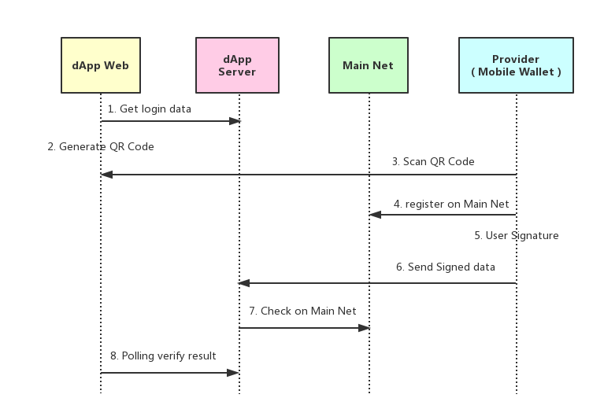

## 目的

将ONTID协议引入生态合作伙伴钱包内，推广ONTID。

## 背景

当前ONTID的使用的问题
- 1 ONTID保存只有keystore一种方法，用户保存能力有限，容易丢失。
- 2 ONTID局限于ONTO中，用户覆盖范围不足，无法在生态中实现更多功能。
- 3 ONTID附带的认证存在本地，由于意外等原因，用户丢失身份认证的情况经常发生。
- 4 ONTID是一长串字符，难以区分，无法辨识。

为了适应即将到来的dAPP开放平台，加强ONTID和用户的绑定，方便用户管理自己的身份信息，我们对ONTID在注册，管理，授权，认证这四个方面进行了重新设计

## 注册ONTID
目前支持ONT的钱包都只有Account，没有ONTID，而ONTID和Account的差别只是在于是否在主网上做注册，基于Cynao Mobile组件提供的功能，在合作方钱包中有两个方案完成ONTID注册。

- 1 用户可以将钱包上已有的Account注册为ONTID
- 2 用户在钱包上创建新Account的时候可以选择是否注册成ONTID

#### 已有Account的注册ONTID
此情况适用于在provider（合作方钱包）内有资金Account的用户，他们可以几乎无感地完成ONTID注册。

下图描述了在provider（合作方钱包）中登录需要ONTID登录的dApp时的流程

从step 4 可以看到，当该用户的Account不是ONTID的时候，可以去主网上注册成为ONTID。

在这个过程中用户首先被提示其Account尚未注册成ONTID，选择注册后，对注册ONTID的智能合约调用进行签名即完成注册。

#### 创建Account的时候注册ONTID
此情况适用于在provider（合作方钱包）没有本体的资金Account的用户(不管是麦子或者bitkeep都支持多条公链，其中有大量用户使用的是其他公链。)在创建Account的时候可以选择注册成ONTID。

## 管理ONTID
从实践过程中看来，大部分provider为了让用户更易用，注册流程一般是
- 1 注册的时候备份助记词。
- 2 注册后的备份是导出WIF格式的私钥。

为了降低用户理解的难度，ONTID的管理采用同样的方式。

同时provider给已经注册完成的ONTID增加一个已注册的标示，方便用户识别。

例如可以在下图标示出的1处或2处增加ONTID的标示。

#### 扩展
EOS的体系内，注册新钱包的时候就会强制要求注册一个EOS账户（目前主流方案是5RMB一个，微信支付），
这个账号是一个由数字和字母构成的12位的字符串，便于用户记忆。

我们可以开发ONS服务（Ontology Name Service），在每个ONTID注册的时候都映射一个短域名，这样方便用户记忆，短域名相比ONTID，在用户看来更有账号的意义，有利于对用户进行本体身份体系的教育。

## ONTID 授权
ONTID授权和Account授权完全相同，此处不赘述。

可以参考[授权流程](https://github.com/xizho10/OEPs/blob/master/OEP-11/OEP-11.mediawiki#invoke-smart-contract)

## ONTID 认证
此前所有provider中只有ONTO提供了身份认证功能，身份认证全部存储在本地，用户要使用自己的身份就被局限在ONTO中，管理难度很大。根据目前的dApp开放策略，结合[ONTPASS](https://developer.ont.io/ontpass/introduction)进行身份管理，所有的身份认证将会加密存储于ONTPASS服务器中，配合上一个身份管理dApp，可以实现以下目标：
- 1 用户只要保护好自己ONTID的私钥，就可以随时管理自己的身份认证。
- 2 不再受到ONTO或者单一设备的限制，一处认证，到处可用。
- 3 降低provider的接入难度，provider无感接入，也没有app内保存用户数据的担忧。

#### dApp内完成身份认证流程

## 总结
总体来说，就是通过Cynao Mobile组件在生态合作钱包内的植入创造基础条件，dApp激励计划吸引更多带有ONTID的dApp，进而吸引更多用户创建ONTID，同时通过ONTPASS进行身份认证管理，一处认证，到处可用，帮助用户在本体生态内构建起自我掌控的身份体系。
