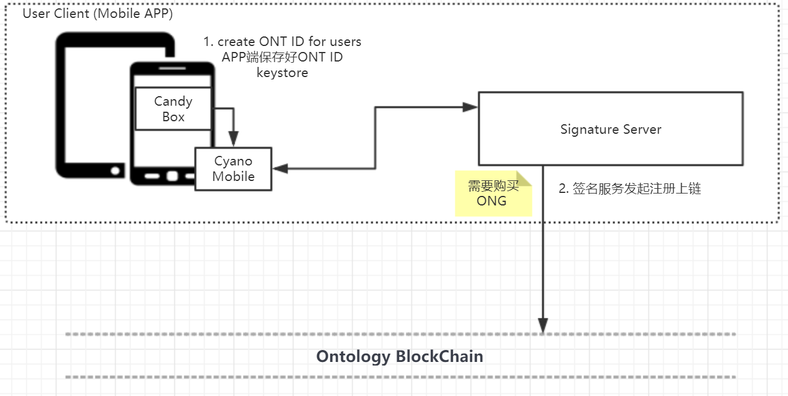
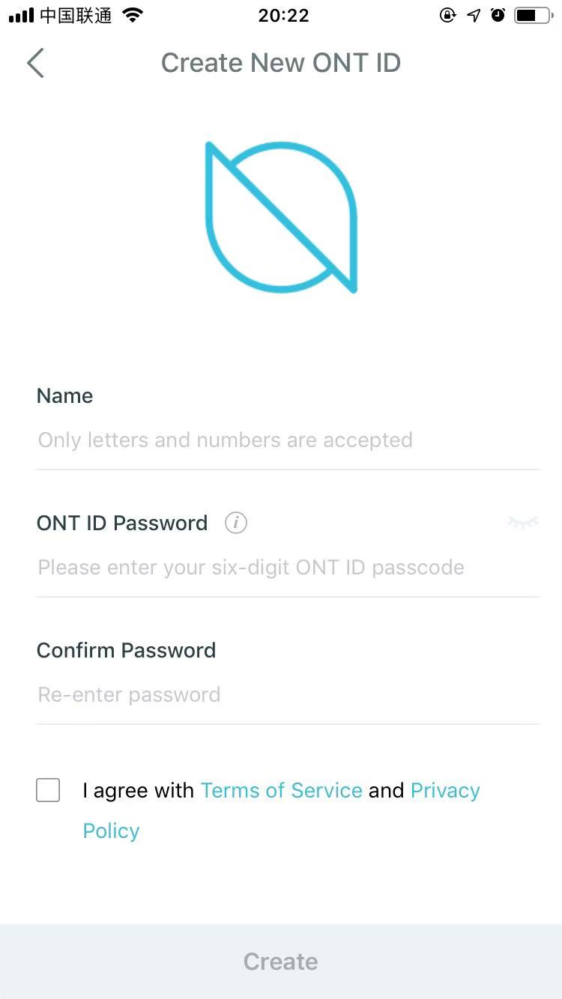
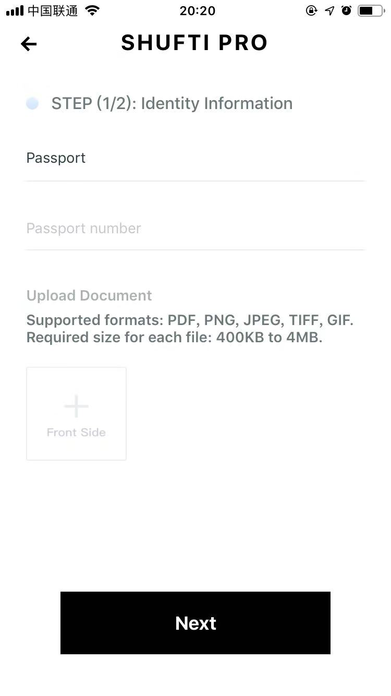
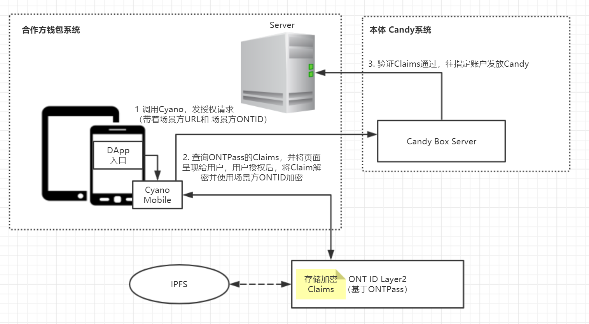
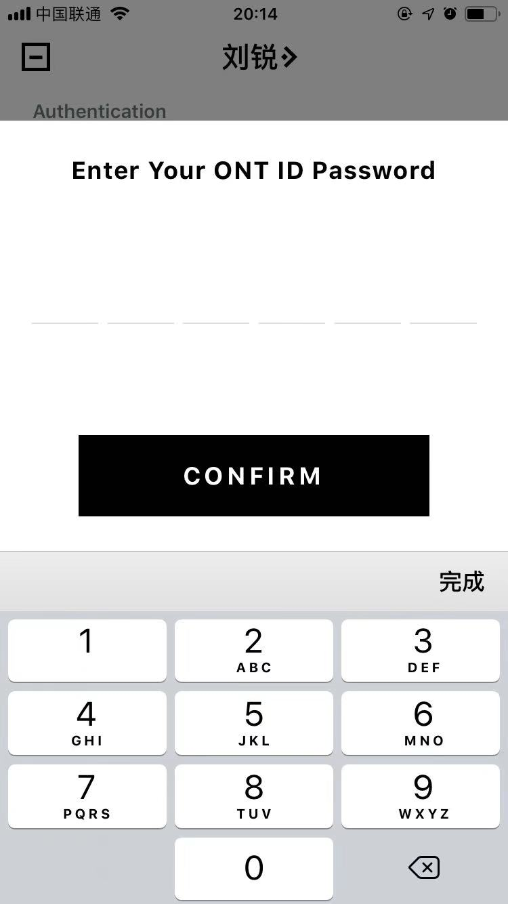

# ONT ID 产品设计

## 目的

通过Cynao Mobile组件在生态合作钱包内的植入ONT ID创造基础条件，dApp激励计划吸引更多带有ONTID的dApp，进而吸引更多用户创建ONTID，同时通过ONTPASS进行身份认证管理，一处认证，到处可用，帮助用户在本体生态内构建起自我掌控的身份体系。

## 设计思路

当前ONTID的使用的问题
- 1 ONTID保存只有keystore一种方法，用户保存能力有限，容易丢失。
- 2 ONTID局限于ONTO中，用户覆盖范围不足，无法在生态中实现更多功能。
- 3 ONTID附带的认证存在本地，由于意外等原因，用户丢失身份认证的情况经常发生。
- 4 ONTID是一长串字符，难以区分，无法辨识。

为了便于推广ONT ID，方便用户管理自己的身份信息，我们引入ONT ID Layer2， 并对ONT ID在注册，管理，授权，认证这四个方面进行了重新规划设计。
- 1 用户只要保护好自己ONTID的私钥，就可以随时管理自己的身份认证。
- 2 不再受到ONTO或者单一设备的限制，一处认证，到处可用。
- 3 降低生态合作伙伴钱包的接入难度，生态合作伙伴钱包无感接入，也没有app内保存用户数据的担忧。


## 一、场景触发注册ONT ID全流程

和ONTO不同，生态合作伙伴钱包（麦子、Onion等）会集成业务场景，在场景中才触发ONT ID的生成 ，比如用户在Candy Box中需要KYC，所有触发ONT ID注册。

在使用之前需要在ONTPass平台注册， 具体参考[>> ONTPass 认证需求方注册API](http://pro-docs.ont.io/#/docs-cn/ontpass/ontpass-auth?id=step-3-ontpass%E5%B9%B3%E5%8F%B0%E6%B3%A8%E5%86%8C)

全流程设计如下：
 

* **Cyano Mobile的职责:**  帮助钱包方生成私钥和Keystore；
* **签名服务的职责:**  代付钱包方的ONT ID的上链费用，构造Payer签名

#### API_1 发起用户认证并开通ONT ID
```
	{
		"action":"registerONTID",
		"version":"v1.0.0";
		"params":{
			"payer":"";
		}
	}
```

返回
```
	{
		"action": "registerONTID",
		"version": "v1.0.0"
		"error": 0,
		"desc": "SUCCESS",
		"result": {
			"ontid":"",
			"registerOntidHex":"",
			"keystore":""	
		}
	}
```
#### API接口_2 KYC提交

参考[>> ONTPass 全球认证服务接口定义](http://pro-docs.ont.io/#/docs-cn/ontpass/ONTTA)。

#### API接口_3 收到KYC结果

```
	{
		"action": "registerONTID",
		"version": "v1.0.0"
		"error": 0,
		"desc": "SUCCESS",
		"result": {
		}
	}
```

#### 页面显示规范

 

 


## 二、ONT ID 授权

ONT ID授权指的是把用户已经获得的认证，授权给场景方，比如在CandyBox场景中，用户需要将授权信息提供给Candy项目方，才可以获得Candy。 流程是这样的：

 

* **Cyano Mobile的职责:** 需要提供Claim的加密、解密；

#### API接口_4 授权
```
{
	"action": "authorization",
	"version": "v1.0.0",
	"params": {
        "txnID": "candybox",
		"toONTID": "",
		"callbackURL": ""，
		"authContexts": {
			"M": [
			],
			"O": [
				"ClaimContext": "claim:idm_passport_authentication",
				"ClaimContext": "claim:idm_idcard_authentication",
				"ClaimContext": "claim:idm_dl_authentication",
				"ClaimContext": "claim:st_dl_authentication",
			],
			"OMaxNum": 1,
			"OMinNum": 1
		}
	}
}
```

返回
```
	{
		"action": "authorization",
		"version": "v1.0.0"
		"error": 0,
		"desc": "SUCCESS",
		"result": {	
		}
	}
```

#### API接口_5 Candy发放

> 注意：以下接口为示例接口，和钱包再确认？？

```
	{
		"action": "candybox",
		"version": "v1.0.0"
		"error": 0,
		"desc": "SUCCESS",
		"result": {
            "ontid":"",
            "candyType":"",
            "amount":""
		}
	}
```


#### 页面显示规范

 

 


## 管理ONT ID

ONT ID 的管理包括：

* **导入**，支持WIF 和 KeyStore两个方式导入，Cyano Mobile 支持这两种方式的库；
* **查询**，生态合作伙伴钱包随时显示ONT ID的地址，并在输入密码的情况下，显示WIF私钥和 Keystore信息。 
* **管理**，生态合作伙伴钱包使用ONT ID Keystore存储规范存储在客户端；

//TODO
提供一个显示规范


## ONTO的改造

* ONT ID导入支持WIF；
* Claim默认存储到ONTPass，DropBox作为辅助选项；
* 集成Cyano Mobile，实现加密，解密；
* 授权环节，兼容Claim存储在本地和ONTPass，两种情况。


## ONT ID Layer2

ONT ID Layer2 在本体Blockchain 基础上，封装了ONT ID的注册、Verifiable Claim的去中心化存储职能，便于dAPP集成ONT ID和使用ONT ID。
在架构设计上 ONT ID Layer2 连接了去中心化存储，也同时使用了中心化系统的高效机制。 

ONT ID Layer2（ONTPass）增加对同一身份开通多个ONT ID的控制，避免刷羊毛的产生。

> 解决方案：TrustAnchor侧需要增加控制重复注册机制。

* **登录验证** ONT ID Layer2（ONTPass）提供一个登录验证接口，钱包方传入ONT ID及签名，ONTPass返回用户的Claims 信息；具体可以参考[这里](http://pro-docs.ont.io/#/docs-cn/ontpass/ONTTA?id=%E7%94%A8%E6%88%B7%E4%BD%BF%E7%94%A8)
