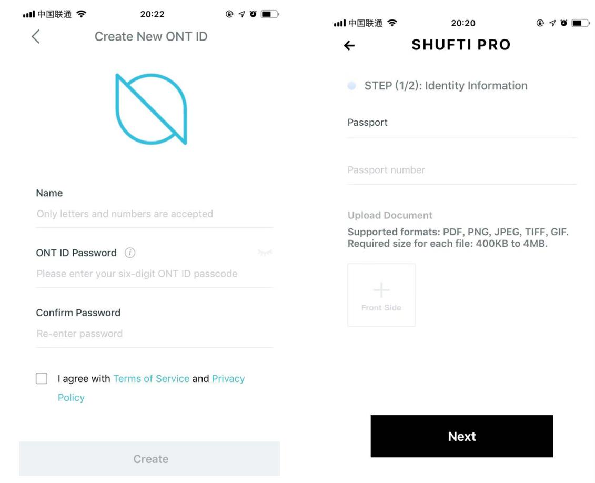

# KYC & CandyBox 对接方案

本体多个应用场景要求需要先完成KYC并开通ONTID，才可以进行业务使用。以下以Candybox业务对接为场景进行方案描述。


## 一、KYC及注册ONT ID全流程


需要在ONTPass平台注册， 具体参考[>> ONTPass 认证需求方注册API](http://pro-docs.ont.io/#/docs-cn/ontpass/ontpass-auth?id=step-3-ontpass%E5%B9%B3%E5%8F%B0%E6%B3%A8%E5%86%8C)

全流程设计如下：
 


#### API_1 发起用户认证并开通ONT ID
```
	{
		"action":"registerONTID",
		"version":"v1.0.0";
		"params":{
			"payer":"";
		}
	}
```

返回
```
	{
		"action": "registerONTID",
		"version": "v1.0.0"
		"error": 0,
		"desc": "SUCCESS",
		"result": {
			"ontid":"",
			"registerOntidHex":"",
			"keystore":""	
		}
	}
```
#### API接口_2 KYC提交

参考[>> ONTPass 全球认证服务接口定义](http://pro-docs.ont.io/#/docs-cn/ontpass/ONTTA)。

#### API接口_3 收到KYC结果

```
	{
		"action": "registerONTID",
		"version": "v1.0.0"
		"error": 0,
		"desc": "SUCCESS",
		"result": {
		}
	}
```

#### 页面显示规范

 

 


## 二、授权并获取Candy

ONT ID授权指的是把用户已经获得的认证，授权给场景方，比如在CandyBox场景中，用户需要将授权信息提供给Candy项目方，才可以获得Candy。 流程是这样的：

 


#### API接口_4 授权
```
{
	"action": "authorization",
	"version": "v1.0.0",
	"params": {
        "txnID": "candybox",
		"toONTID": "",
		"callbackURL": ""，
		"authContexts": {
			"M": [
			],
			"O": [
				"ClaimContext": "claim:idm_passport_authentication",
				"ClaimContext": "claim:idm_idcard_authentication",
				"ClaimContext": "claim:idm_dl_authentication",
				"ClaimContext": "claim:st_dl_authentication",
			],
			"OMaxNum": 1,
			"OMinNum": 1
		}
	}
}
```

返回
```
	{
		"action": "authorization",
		"version": "v1.0.0"
		"error": 0,
		"desc": "SUCCESS",
		"result": {	
		}
	}
```

#### API接口_5 Candy发放

> 注意：以下接口为示例接口，和钱包再确认？？

```
	{
		"action": "candybox",
		"version": "v1.0.0"
		"error": 0,
		"desc": "SUCCESS",
		"result": {
            "ontid":"",
            "candyType":"",
            "amount":""
		}
	}
```


#### 页面显示规范

 

 


## ONT ID管理要求

钱包需要对ONT ID 提供管理功能，具体包括：

* **导入**，支持WIF 和 KeyStore两个方式导入，Cyano Mobile 支持这两种方式的库；
* **查询**，生态合作伙伴钱包随时显示ONT ID的地址，并在输入密码的情况下，显示WIF私钥和 Keystore信息。 
* **管理**，生态合作伙伴钱包使用ONT ID Keystore存储规范存储，并随时可用用户使用；

页面规范可以参考ONTO
